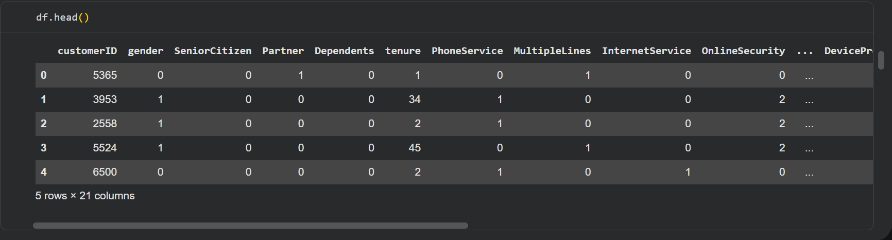
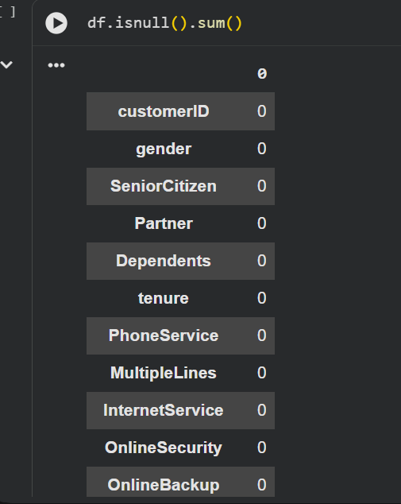
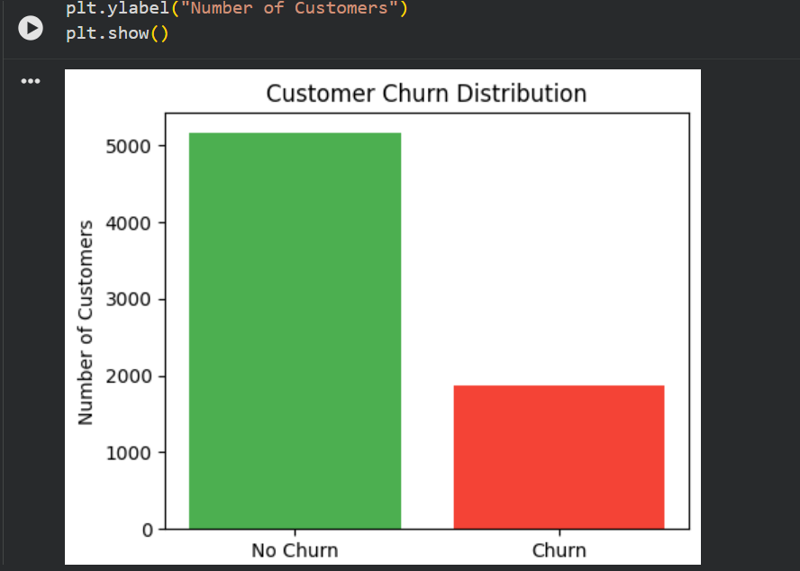
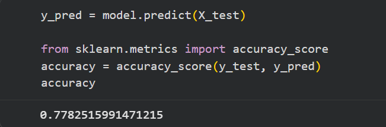

# 📉 Customer Churn Prediction – Python (Machine Learning)

A machine learning project that predicts customer churn using the IBM Telco Customer dataset. Includes data preprocessing, feature engineering, Logistic Regression modeling, evaluation, and key business insights.

This project predicts **customer churn** using the IBM Telco Customer dataset.  
The goal is to identify which customers are likely to leave and what factors influence their decision.  
The model achieves **~80% accuracy** using Logistic Regression.


---

## 📁 Project Structure

```
Customer-Churn-Prediction-Model-Python/
│
├── data/
│   └── WA_Fn-UseC_-Telco-Customer-Churn.csv
│
├── notebook/
│   └── customer_churn_model.ipynb
│
└── README.md
```

---

## 🚀 Project Overview

This end-to-end ML project includes:

✔ Data cleaning and preprocessing  
✔ Encoding categorical features  
✔ Handling missing values  
✔ Feature engineering  
✔ Logistic Regression model  
✔ Evaluation metrics  
✔ Identifying churn drivers

---

## 📊 Dataset Information

**Source:** IBM Sample Telco Customer Churn Dataset  
**Rows:** 7,043  
**Columns:** 21  
**Target Variable:** `Churn` (Yes / No)

**Key Features:**
- Customer demographics  
- Internet & phone services  
- Contract details  
- Charges (monthly and total)  
- Tenure  

---

## 🛠 Technologies Used

- **Python**
- **Pandas**, **NumPy**
- **Scikit-learn**
- **Matplotlib** (optional visualizations)
- **Google Colab / Jupyter Notebook**

---

## 🔧 Steps Performed

### **1️⃣ Data Cleaning**
- Removed missing values
- Converted `TotalCharges` (string) → numeric
- Dropped irrelevant columns like `customerID`

### **2️⃣ Feature Engineering**
- Label Encoding for binary columns
- One-Hot Encoding for multi-category columns
- Train-test split (80/20)

### **3️⃣ Model Building**
Used **Logistic Regression**:

- Tuned `max_iter`
- Fitted on training data
- Predicted churn on test data

### **4️⃣ Model Evaluation**
- Accuracy Score  
- Confusion Matrix  
- Classification Report  

📌 **Model Accuracy:** ~80%

---

## 🔍 Key Insights

### 🔹 Customers most likely to churn:
- Short tenure customers (new customers leave often)
- Customers with **high monthly charges**
- Month-to-month contract users
- Fiber optic internet service users

### 🔹 Customers least likely to churn:
- Long-term contract customers (1 or 2 years)
- Customers with lower monthly bills

These insights help companies build better retention strategies.

---

## 🖼️ Results Snapshot

Here are the key outputs from the model:

### 📊 1. Data Overview


### 🧹 2. Data Cleaning


### 📈 3. Churn Distribution


### 🎯 4. Model Accuracy


### 📋 5. Classification Report


## 🧠 Why This Project Matters

Churn prediction is one of the most important business problems in:
- Telecom
- SaaS
- Banking
- Subscription services

Predicting which customers are about to leave helps companies reduce revenue loss.

---

## 📌 How to Run This Project

### **1. Clone the repo**
```bash
git clone https://github.com/vikrutisrija/Customer-Churn-Prediction-Model-Python.git
cd Customer-Churn-Prediction-Model-Python
```

### **2. Open the notebook**
Use Google Colab or Jupyter Notebook to run:

`notebook/customer_churn_model.ipynb`

### **3. Install dependencies**
```bash
pip install pandas numpy scikit-learn matplotlib
```

---

## 📈 Future Improvements

- Add XGBoost / Random Forest for higher accuracy  
- Deploy the model using Flask or FastAPI  
- Build a Power BI dashboard for churn analytics  
- Create a customer segmentation model (RFM Analysis)

---

## 🏁 Conclusion

This project demonstrates:

✔ Data preprocessing  
✔ Statistical analysis  
✔ Logistic Regression modeling  
✔ Identifying key churn factors  
✔ Building explainable ML solutions  

It is a strong, real-world project for Data Analyst & ML roles.

---

## 📬 Contact
If you'd like to collaborate or have opportunities, feel free to connect!

**LinkedIn:** https://www.linkedin.com/in/vikruti-srija-648738285  
**GitHub:** https://github.com/vikrutisrija
